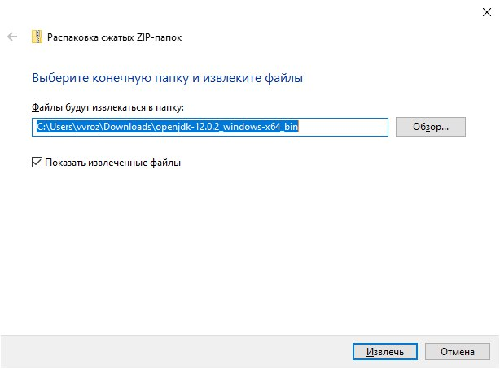
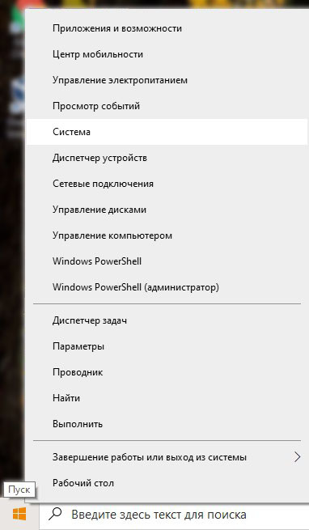
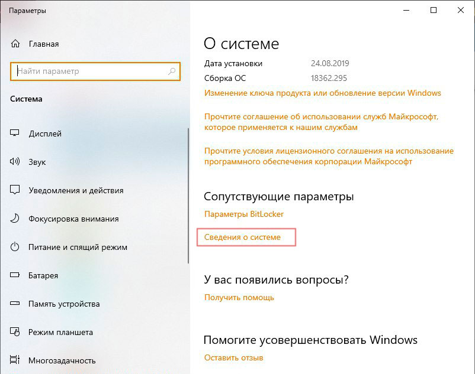
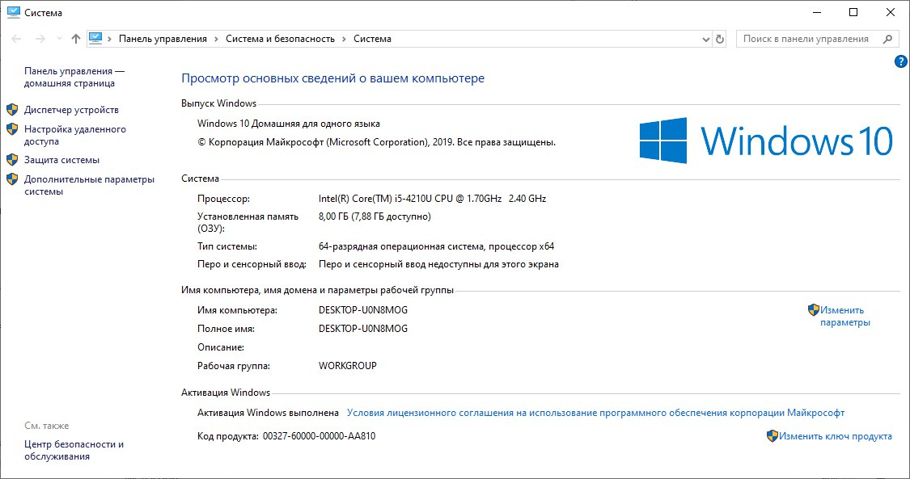
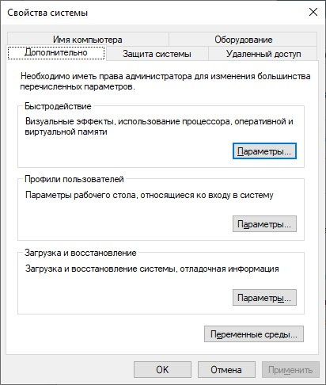
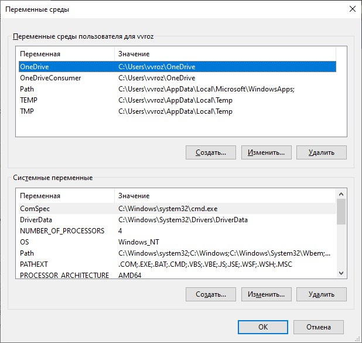
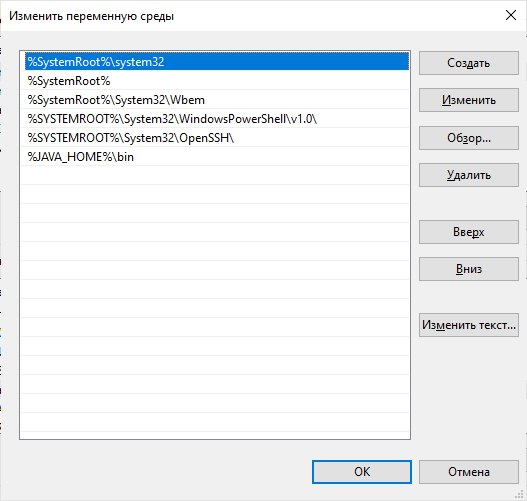

## Скачиваем JDK 

Чтобы скачать пакет Open JDK нужно:

* Зайти на сайт [jdk.java.net](https://jdk.java.net/)
* Перейти по ссылке с нужной версией Java, последняя стабильная версия Java находится в пункте Ready for use
* В разделе Build выбираем ссылку на архив с пакетом. Для Windows - это Windows / x64	zip (sha256)

## Извлекаем архив

* Нажать правой кнопкой мыши на скаченный архив и выбрать `Извлечь всё`
* Оставляем путь извлечения по умолчанию в туже папку и нажимаем `Извлечь`

<div id="terminal" class="screen">
<div class="window">


<br/>
<span class="comment">Извлечение jdk архива</span>
</div>
</div>

* Создаем папку для хранения jdk `C://Program Files(x86)/Java/` и копируем в неё извлеченный архив. Получаем следущую иерархию:


 ```bash hljs
 | C:
    |-- Program Files (x86)
        |-- Java
            |-- jdk
 ```

 ## Настраиваем переменные окружения PATH и JAVA_HOME

 &nbsp;&nbsp;&nbsp;&nbsp;&nbsp; Сначала настроим переменную `JAVA_HOME`.

* Нажать правой кнопкой мыши на меню Пуск и выбрать пункт "Система"

<div id="terminal" class="screen">
<div class="window">


<br/>
<span class="comment">Пуск - Система</span>
</div>
</div>

* Выбрать "Сведения о системе"

<div id="terminal" class="screen">
<div class="window">


<br/>
<span class="comment">Сведения о системе</span>
</div>
</div>

* Выбрать "Дополнительные параметры"

<div id="terminal" class="screen">
<div class="window">


<br/>
<span class="comment">Дополнительные параметры</span>
</div>
</div>

* Перейти на вкладку "Дополнительно" и нажать кнопку "Переменные среды"

<div id="terminal" class="screen">
<div class="window">


<br/>
<span class="comment">Переменные среды</span>
</div>
</div>

Далее есть 2 варианта:

* переменная JAVA_HOME ещё не добавлена<br>
\- нажимаем кнопку "Создать"(Системные переменные) и вводим имя переменной: JAVA_HOME, значение: путь к папке jdk(до папки bin)

<div id="terminal" class="screen">
<div class="window">


<br/>
<span class="comment">Добавляем переменную JAVA_HOME</span>
</div>
</div>

* переменная JAVA_HOME уже добавлена<br>
\- проверяем что директория указана верно, если нет то нажимаем Изменить и редактируем директорию в поле значение

<div id="terminal" class="screen">
<div class="window">


<br/>
<span class="comment">Нажать "Изменить", если переменная JAVA_HOME уже существует</span>
</div>
</div>

Теперь можно приступить к настройке переменной PATH:

* Находим в списке переменных среды переменную PATH и нажимаем "Изменить"

<div id="terminal" class="screen">
<div class="window">


<br/>
<span class="comment">Нажать "Создать"</span>
</div>
</div>

* В окне "Изменить переменную среды" нажать "Создать"
* ввести `%JAVA_HOME%\bin`
* нажать "ОК" во всех открытых диалоговых окнах