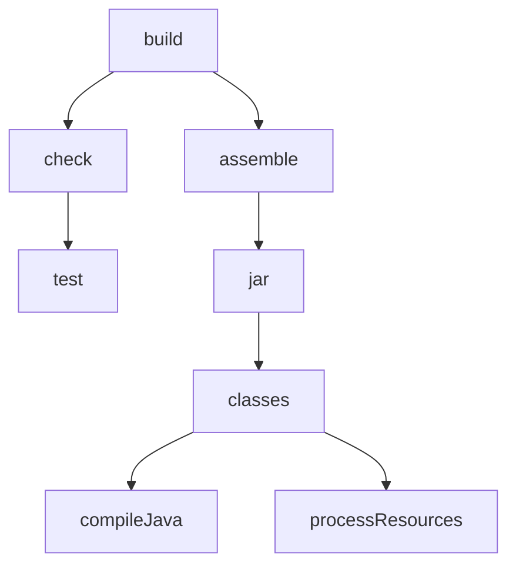

Gradle - это фреймворк который отвечает за структуру, зависимости, плагины вашего проекта для того чтобы управлять этапами сборки этого проекта: компиляция, запуск тестов, публикация. 

Написан на Java  и запускается на JVM. 

Для реализации и описания процесса сборки в Gradle реализовано 2 DSL языка на Groovy и на Kotlin.
Оба этих языка предоставляют примерно одинаковый API для работы со сборкой и имеют 2 интерфейса, которые эту сборку описывают.

`project` - описывает как и из чего собрать проект;  
`settings.gradle` - описывает дополнительные метаданные и список дочерних проектов, если это мультимодульный проект;

## `project`

### task
Представляет собой набор задач, который вам нужно выполнить для сборки приложения; эти задачи можно писать самим или добавлять через плагины.

### plugin
Плагин - это реализация методов интерфейса project, которые могут реализовывать работу с зависимостями, добавлять нужные таски и почти полностью менять, то как работает процесс сборки.

### dependencies
Можно указать необходимые зависимости для работы вашего приложения. Gradle реализует только логику управления зависимостями а сам репозиторий можно выбрать, настроив это в build скрипте. Это может быть например maven репозиторий.

Тип Task в Gradle это по сути класс, который состоит из действия, которое выполняет класс или нескольких действий, входных и выходных данных.

Каждая из этих состовляющих кастомизируема и необязательна. Например, существуют LifeCycle таски, которые сами ничего не делают, но объединяют несколько других тасок.

За счет такого разделения Gradle реализует **_инкрементальную_** сборку: перед выполнением таски Gradle проверяет есть ли изменения входных данных и повлияют ли эти изменеия на выходные данные. Если нет, то Gradle просто пропустит таск с надписью **UP TO DATE**, таким образом оптимизируется процесс сборки, чтобы каждый раз не собирать неизменяемые модули, а собирать только то, что изменилось, но эту логику также можно отключить.

Чтобы обеспечить нужный порядок выполнения тасок Gradle строит ориентированный ациклический граф (**DAG, Directed Acyclic Graph**). 

Граф - это набор объектов(в нашем случае тасок), обладающих парными связями (каждая таска связана с одной или несколькими(двумя) тасками). 

Таски - вершины, связи между ними - ребра. 

То что граф ориентированный значит, что у ребер есть направление (порядок исполнения тасок), то что он ациклический означает, что в нем нет направленных циклов, нельзя из одной точки прийти в нее же, но это не мешает из разных точек прийти в одну. 

**Граф для сборки Java приложения**



## Сборка Java приложения
Процесс сборки делится на 3 тапа: инициализация, конфигурация и исполнение. 

### Инициализация
В процессе инициализации Gradle ищет `settings.gradle` файл, из которого определяет это одиночный или мультимодульный проект. После этого он создает instance одного или нескольких проектов. 

### Конфигурация
Далее в процессе конфигурации, gradle для каждого проекта ищет build.gradle скрипт и выполняет все указанные там конфигурационные действия в контексте текущего проекта: подключает плагины, скачивает зависимости, выполняет код находящийся в конфигурационном блоке, создавая объекты сборки. 

Во время фазы конфигурации gradle исполняет конфигурационные скрипты всех проектов если это мультимодульный проект, даже если вы собираете только один из модулей. Так что если логика не относится ко всему мультимодульному проекту, лучше ее помещать в конкретные таски. 

### Исполнение
По сути в процессе конфигурации он строит тот самый граф из тасок и в процессе выполнения, исполняет те таски, которые мы указали.


Иннициализация Gradle проекта выполняется командой gradle init.

```
$ gradle init
```

Далее нужно ответить на несколько вопросов и дождаться окончания инициализации.
После этого в проекте будут созданы файлы: 
- gradlew(исполняющий файл для Linux подобных систем), gradlew.bat(исполняющий файл для Windows);
- папка gradle, в которой папка wrapper;  
Как раз этот wrapper и запускает скрипты. Gradle использует wrapper, чтобы можно было однозначно понять версию Gradle, которая будет использоваться для сборки.  
Wrapper сам скачает эту версию Graddle, если на машине он не установлен. Поменять версию и откуда его скачивать можно в файле gradle/gradle-wrapper.properties
- build.gradle, settings.gradle

В **settings.gradle** указано только имя проекта, для мультимодульных проектов также здесь указывается список модулей. 

В **build.gradle** имеются следущие секции:

- секция plugins  
Здесь размещается обычно плагин id: 'java', который используется для сборки java проектов;  
Еще существует плагин java-library, он используется если вы хотите поставлять ваше приложение как библиотеку.

```groovy
plugins {
    id 'java'
}
```

- секция repositories  
Здесь можно задать url репозитория из которого будут скачиваться зависимости. Для стандартного Maven репозитория есть алиас mavenCentral().

```groovy
repositories {
    mavenCentral()
}
```

Также в build.gradle, как и в Maven содержатся group, version, description, java.sourceCompatibility, но в отличие от Maven их указывать не обязательно Gradle сможет сам сгенерировать эти данные.
После компиляции нам доступны таски.

- секция dependencies  

Есть несколько типов зависимостей:
- implementation - зависимость доступна и в main и в test директориях
- testImplementation - зависимость доступна только в test директории
- testAnnitationProcessor - зависимость, которая генерирует код в рантайме на основе аннотаций

```groovy
dependencies {
    implementation 'com.codeborne:selenide:6.6.3'
    testImplementation 'org.junit.jupiter:junit-jupiter:5.8.2'
    testRuntimeOnly 'org.junit.jupiter:junit-jupiter-engine:5.8.2'
    testAnnotationProcessor 'org.projectlombok:lombok:1.18.24'
}
```

Чтобы после билда запустились тесты, нужно указать каким движком нужно запустить тесты.

```groovy
test {
    useJUnitPlatform()
}
```

Когда зависимость требует какой то сложной конфигурацией она зачастую реализуется плагином. Тогда достаточно подключить плагин и не нужно добавлять несколько зависимостей.

Вместо testAnnotationProcessor которую мы прописывали для lombok можно добавить плагин.

```groovy
plugins {
    id 'io.freefair.lombok' version'5.3.0'
}
```

## Custom task

Для добавления своей таски используется коллекция tasks и новые таски в нее добавляются с помощью методы register. В метод register нужно передать название таски(по этому названию мы в последствии сможем обращаться к этой таске)
второй параметр опционален, в него можно передать тип таски можно использовать стандартный тип Test который был добавлен Java плагином. 

### Таска для запуска тестов из определенной директории
Отфильтровать тесты которые будут запускаться можно с помощью блока filter в нем есть метод includeTestsMatching.
На вход этому методу можно передать wildcard - часть пути до наших тестов со звездочкой.  

```
src
├── main
    ├── java
        ├── simple
            ├── automation
├── test
    ├── java
        ├── rest
        ├── utils
        ├── web
            ├── findby
            ├── simple
```

```groovy
tasks.register('webtests', Test).configure() {
    filter {
        includeTestsMatching("web.simple*")
    }
}
```

### Указываем платформу для запуска тестов из Custom Tasks 

Чтобы не прописывать в каждой таске, что она должна запускаться с помощью Junit можно выполнить одну настройку для всех тасок с типом test. 
Для этого на контейнере tasks используем метод withType, который выберет все таски с типом Test, и внутри конфигурационного блока используем useJUnitPlatform().

```groovy
tasks.withType(Test) {
    useJUnitPlatform()
}
```

### Зауск тестов из Custom Task
Выполняем запуск тестов webtests командой:

```
$ ./gradlew webtests
```

### Добавляем еще одну custom таску
Аналогично можно настроить запуск для rest тестов:

```groovy
tasks.register('resttests', Test).configure() {
    filter {
        includeTestsMatching("rest*")
    }
}
```

### Добавляем зависимость одной таски от другой
Бывает что rest тесты могут использоваться при выполнении web тестов и зачастую бывает удобно прогонять web тесты только если прошли rest тесты.
Для этого в Gradle есть метод dependsOn с аргументом в виде названия таска, от которой зависит текущая таска. 

```groovy
tasks.register('webtests', Test).configure() {
    filter {
        includeTestsMatching("web.simple*")
    }
    dependsOn 'resttests'
}
```

Соответсвенно, при запуске web тестов будут также запущены rest тесты и они выполнятся только если rest тесты пройдут. 

### Запуск независимых тасок в одном скоупе
Но если у нас rest и web тесты работают независимо как разные модули или части системы, мы можем создать еще один таск regress, который будет запускать и те и другие тесты. Используем тот же метод dependsOn но уаазываем и web и rest тесты.

```groovy
tasks.register('regress') {
    dependsOn 'webtests'
    dependsOn 'resttests'
}
```

Но в таком виде запуска мы не знаем в каком порядке запустятся эти таски. 

### Настраиваем порядок запуска тасок
Если мы хотим определить порядок, например, чтобы web тесты запускались после rest тестов, мы можем использовать метод mustRunAfter или shouldRunAfter(является менее строгим и не запускает тесты если из-за зависимости образуется петля).
Чтобы найти ранее созданный таск используем метод getByName и из него запускаем mustRunAfter с аргументом ввиде названия таски после которой нужно запускать.

```groovy
tasks.register('regress') {
    dependsOn 'webtests'
    dependsOn 'resttests'
    
    tasks.getByName('webtests').mustRunAfter('resttests')
}
```

Либо при создании таска можно сохранить ее в переменную и тогда можно использовать эти переменные для вызова mustRunAfter.
```groovy
def webtests = tasks.register('webtests', Test).configure() {
    filter {
        includeTestsMatching("web.simple*")
    }
}

def resttests = tasks.register('resttests', Test).configure() {
    filter {
        includeTestsMatching("rest*")
    }
}

tasks.register('regress') {
    dependsOn 'webtests'
    dependsOn 'resttests'

    webtests.mustRunAfter(resttests)
}
```

### Запуск тестов из директории main
Если по какой то причине тесты оказались не в папке test, а в папке main, то по умолчанию Gradle найти там тесты не может. Поэтому для того чтобы указать нестандартное место исходников можно использовать блок sourceSets.

1. Добавляем новый sourceSet

Для создания нового сета, просто пишем имя сета и скобку, внутри добавляем блок java чтобы указать свойства которые были добавлены java плагином, compileClasspath и runtimeClasspath, добавляем через += чтобы не затирать текущие значения. 
Добавляем туда путь к папке main - main.output. Чтобы указать где взять исходники используем свойство srcDir. 

```groovy
sourceSets {
    maintests {
        java {
            compileClasspath += main.output
            runtimeClasspath += main.output
        }
        srcDir = file("src/main/java/simple/automation")
    }
}
```

2. Настраиваем зависимости для добавленного sourceSet

Также нам нужны зависимости из блока dependencies, по умолчанию они в блок sourceSet не попадают.
Для этого используется блок configurations, в нем указываем имя нашего sourceSet и без пробела пишем Implementation или RuntimeOnly. 
Далее с помощью метода extendsFrom можем указать, что зависимости нужно брать стандартные из testImplementation и testRuntimeOnly.


```groovy
configurations{
    maintestsImplementation.extendsFrom(testImplementation)
    maintestsRuntimeOnly.extendsFrom(testRuntimeOnly)
}
```

3. Добавляем таск для запуска тестов, используя sourceSet

Создаем таск для запуска псевдотестов и указываем, что нужно использовать наш кастомный sourceSet.

```groovy
tasks.register('pseudotests', Test){
    testClassesDirs = sourceSets.maintests.output.classesDirs
    classPath = sourceSets.maintests.runtimeClasspath
}
```

4. Добавляем фильтрацию по тегам JUnit

Теперь нужно отфильтровать псевдотесты чтобы запускались только они. Сделать как в предыдущих тасках мы не можем потому что по имени package simple.automation будут запущены также и web тесты.
Но можно использовать фильтрацию по тегам Junit. Для этого вызываем метод useJUnitPlatform, но к нему добавляем конфигурационный блок includeTags и тег методов или классов которые хотите запустить.

```groovy
tasks.register('pseudotests', Test){
    testClassesDirs = sourceSets.maintests.output.classesDirs
    classPath = sourceSets.maintests.runtimeClasspath

    useJUnitPlatform{
        includeTags "pseudo"
    }
}
```

### Запуск тестов с логированием
Чтобы добавить уровень логирования INFO при запуске gradlew нужно добавить ключ -i.
Таком образом мы увидим сообщения которые выводятся в консоль из тестов.

```
$ ./gradlew -i pseudotests
```

### Отключаем инкрементальный билд при запуске
Но сразу мы можем их не увидеть из-за инкрементального билда.
Так как между запусками исходники тестов не поменялись Gradle просто не запустит их.
Чтобы они запустились перед таской с тестами запустим также таску clean. Это актуально для запуска тестов из контекста main.
Если запускаются тесты из директории test то нужно использовать таску cleanTest.

```
$ ./gradlew -i clean pseudotests
```

### Отключаем инкрементальный билд глобально при настройке таски
Чтобы каждый раз не вызывать clean таску можно установить значение upToDateWhen в знасение false для всех тасок с типом Test.

```groovy
tasks.withType(Test) {
    useJUnitPlatform()
    outputs.upToDateWhen {false}
}
```

Если запускаетя несколько независимых тасок с тестами, то Gradle по умолчанию останавливает выполнение на первом упавшем тесте. 
Можно настроить чтобы он все равно переходил к следущей задаче даже если упала предыдущая.
Для этого можно при запуске добавить ключ --continue

```
$ ./gradlew --continue resttests webtests
```

### Отключаем стандартную таску test при билде

Для этого нужно в блоке test присвоить свойству enabled значение false

```groovy
test {
    enabled = false
}
``` 

### Порядок выполнения build скрипта 

### Как добавить кастомные экшены к таскам

Создаем еще одну таску, но не указываем тип. В этом случае у таски будет тип DefaultTask и к ней не будет привязано никаких экшенов.
Выводить текст в консоль можно стандартной командой println, но для реального логирования лучше использовать нормальные логгеры.
Добавим вывод текста в блок конфигурирования таски, а также перед таской и после нее.
Чтобы добавить кастомные экшены в таску можно использовать блок doFirst - это действие которое будет выполнено перед стандартными экшенами.
В нашем случае таких экшенов нет а для тасок с типом Test таким стандартным экшеном был запуск тестов.
Еще мы можем использовать блок doLast - запускает кастомные экшены после стандартных. И doFirst и doLast можно использовать несколько раз, тогда они будут исполняться в указанном порядке. 

После запуска по тексту в консоли мы видим порядок выполнения.

```groovy
println "from build script root"
tasks.register("gradleTest").configure{
    println "from task root"
    doFirst {
        println "from do first"
    }
    doLast {
        println "from do last"
    }
    doLast {
        println "from do last 2"
    }
}
println "from build script root 2"
```

Результат выполнения:

```console
$ ./gradlew clean gradleTest

> Configure project :
from build script root
from build script root 2
from task root

> Task :gradleTest
from do first
from do last
from do last 2

BUILD SUCCESSFUL in 637ms
2 actionable tasks: 1 executed, 1 up-to-date
```

Сначала вполняется код конфигурации, затем код конфигурации самой таски (код внутри таски вне блоков doFirst и doLast), 
а уже дальше выполняются экшены сначала doFirst, потом doLast в порядке в котором они указаны в скрипте.

> Стоит иметь ввиду если бы у нас был многомодульный проект, то сначала вполнился бы код конфигурации из всех build скриптов всех модулей.

Тип таски это прсто класс. Можно создать свой тип. 
Для этого используется метод с аннотацией @TaskAction, при этом класс должен наследоваться от DefaultTask.

```groovy
class CustomTask extends DefaultTask{
    @TaskAction
    def customAction(){
        println "from custom action"
    }
}
```

Теперь можно указать наш кастомный тип при регистрации таски. И теперь между doFirst и doLast экшенами выполнился наш кастомный экшен.

```groovy
println "from build script root"
tasks.register("gradleTest", CustomTask).configure{
    println "from task root"
    doFirst {
        println "from do first"
    }
    doLast {
        println "from do last"
    }
    doLast {
        println "from do last 2"
    }
}
println "from build script root 2"
```

```console
$ ./gradlew clean gradleTest

> Configure project :
from build script root
from build script root 2
from task root

> Task :gradleTest
from do first
from custom action
from do last
from do last 2

BUILD SUCCESSFUL in 1s
2 actionable tasks: 1 executed, 1 up-to-date
```

Таск может состоять из input, actions, output. Добавим input в наш тип. Это можно сделать с помощью переменной с аннотацией @Input.
Присвоим ей дефолтное значение и будем использовать в нашем экшене. Теперь стандартный экшен использует значение из input'а 
и мы можем этот input переопределить в конфигурации самой таски. 

```groovy
println "from build script root"
tasks.register("gradleTest", CustomTask).configure{
    input = "overrided"
    println "from task root"
    doFirst {
        println "from do first"
    }
    doLast {
        println "from do last"
    }
    doLast {
        println "from do last 2"
    }
}
println "from build script root 2"


class CustomTask extends DefaultTask{
    @Input
    String input = "default"

    @TaskAction
    def customAction(){
        println "from custom action with $input"
    }
}
```

После прогона тестов в build/test-results складывается отчет JUnit о прогоне тестов.
Также есть тип таски zip позволяет что-нибудь заархивировать.

Имя итогового архива задается через переменную archiveFileName, с помощью distinationDirectory указываем куда будет сложен этот архив и через
метод from указываем какую именно папку заархивировать. Чтобы указать несколько папок используйте несколько строяек from. 

Таска чтобы заархивировать отчет:

```groovy
tasks.register("zipReport", Zip).configure{
    archiveFileName = 'report.zip'
    distinationDirectory = file("$buildDir/reports")
    from "$buildDir/reports/tests"
}
```

Также потом его нужно куда нибудь скопировать. ддля этого есть тип таски Copy. В ней указываем через from откуда взять файл(также можно указать несколько from),
а в into указываем куда скопировать. 

```groovy
tasks.register('copyReport', Copy).configure{
    from file("$buildDir/reports/report.zip")
    into file("out")
}
```

Еще одна полезная таска это jar - позволяет заархивировать приложение в jar файл. 
У него в блоке manifest в свойстве attributes можно задать атрибут Main-Class который указыывает класс в котром наодится исполняемый метод main 
а в блоке from откуда взять скомпилированные классы 

Jar собирается в папку build/libs и его можно запустить через команду java -jar 

```groovy
jar {
    manifest {
        attributes "Main-Class": "simple.automation.Main"
    }
    from {
        configurations.compile.collect { it.isDirectory() ? it : zipTree(it) }
    }
}
```

## TODO

https://www.youtube.com/watch?v=WOBok2u-SL8

https://www.youtube.com/watch?v=NZJTYPLb0iE